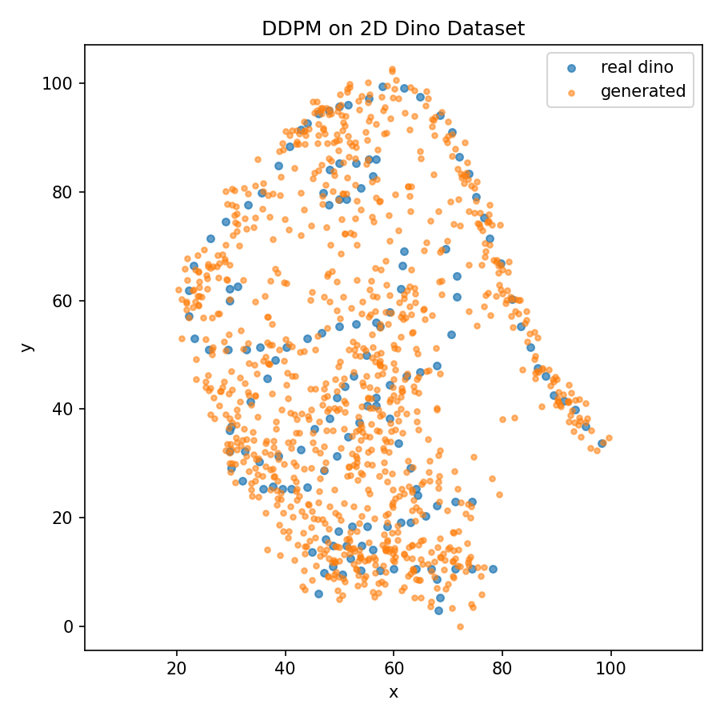
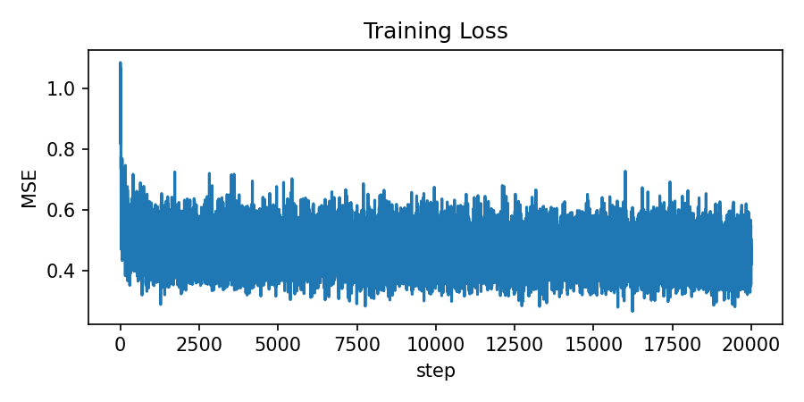

# Dino DDPM (2D)

## what?
This is a from-scratch DDPM (Denoising Diffusion Probabilistic Model) that learns the `dino` shape from `Datashape.tsv` and generates synthetic 2D points.

## run
```bash
python train_dino_ddpm.py --data Datashape.tsv --steps 20000 --hidden 256 --lr 5e-4 --timesteps 400 --schedule cosine --ema-decay 0.999 --grad-clip 1.0 --samples 1000 --out dino_overlay.png
```

## output
- Overlay plot: [dino_overlay.png](./dino_overlay.png)
- Loss plot: [dino_overlay_loss.png](./dino_overlay_loss.png)



